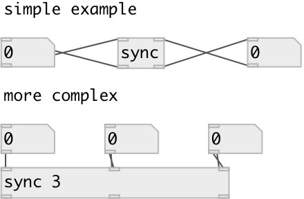

[index](index.html) :: [base](category_base.html)
---

# sync

###### value synchronization

*available since version:* 0.9.1

---

## arguments:

* **N**
number of synchronized values 
_type:_ int 

## inlets:

* first synchronized input 
_type:_ control
* ... synchronized input 
_type:_ control
* n-th synchronized input 
_type:_ control

## outlets:

* first synchronized output 
_type:_ control
* ... synchronized output 
_type:_ control
* n-th synchronized output 
_type:_ control

## keywords:

[sync](keywords/sync.html)

**Authors:** Serge Poltavsky

**License:** GPL3 or later

