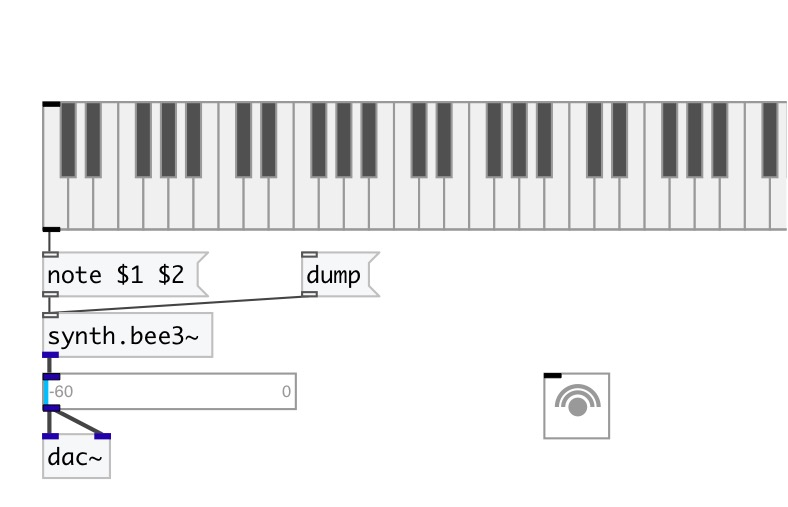

[< reference home](index.html)
---

# synth.bee3~

Hammond-oid organ FM synthesis instrument

---

This class implements a simple 4 operator topology, also referred to as algorithm
            8 of the TX81Z
 

---

---
arguments:

---
properties:

@freq(Hz): maximum speed of whistles 
@gate: synth gate
            (&gt;0 - play) 
@op4: operator 4 (feedback) gain
            (cc2) 
@op3: operator 3 gain
            (cc4) 
@lfo_speed: LFO Speed
            (cc11) 
@lfo_depth: LFO Speed
            (cc1) 
@adsr: ADSR 2 &amp; 4
            Target 

