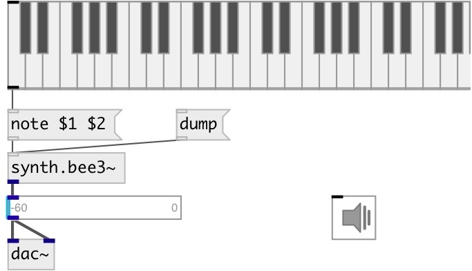

[index](index.html) :: [synth](category_synth.html)
---

# synth.bee3~

###### Hammond-oid organ FM synthesis instrument

*available since version:* 0.6

---

## information
This class implements a simple 4 operator topology, also referred to as algorithm
            8 of the TX81Z

## methods:

* **cc**
Control change 
  __parameters:__
  - **CTL** control number 
    type: int  
    required: True  

  - **VAL** value 
    type: float  
    required: True  

* **note**
note on/off message 
  __parameters:__
  - **NOTE** midi note 
    type: float  
    required: True  

  - **VEL** velocity 
    type: float  
    required: True  

## properties:

* **@freq** 
Get/set maximum speed of whistles 
__type:__ float 
__units:__ Hz 
__range:__ 0..480 
__default:__ 220 

* **@pitch** 
Get/set midi pitch 
__type:__ float 
__range:__ 36..84 
__default:__ 57 

* **@gate** 
Get/set synth gate (&gt;0 - play) 
__type:__ float 
__range:__ 0..1 
__default:__ 0 

* **@op4** 
Get/set operator 4 (feedback) gain (cc2) 
__type:__ int 
__range:__ 0..127 
__default:__ 0 

* **@op3** 
Get/set operator 3 gain (cc4) 
__type:__ int 
__range:__ 0..127 
__default:__ 0 

* **@lfo_speed** 
Get/set LFO Speed (cc11) 
__type:__ int 
__range:__ 0..127 
__default:__ 0 

* **@lfo_depth** 
Get/set LFO Speed (cc1) 
__type:__ int 
__range:__ 0..127 
__default:__ 0 

* **@adsr** 
Get/set ADSR 2 &amp; 4 Target 
__type:__ int 
__range:__ 0..127 
__default:__ 0 

## inlets:

* NOTE VEL 
__type:__ control 

## outlets:

* synth output
__type:__ audio 

## keywords:

[hammond](keywords/hammond.html)
[synth](keywords/synth.html)
[fm](keywords/fm.html)

**Authors:** Serge Poltavsky

**License:** GPL3 or later

