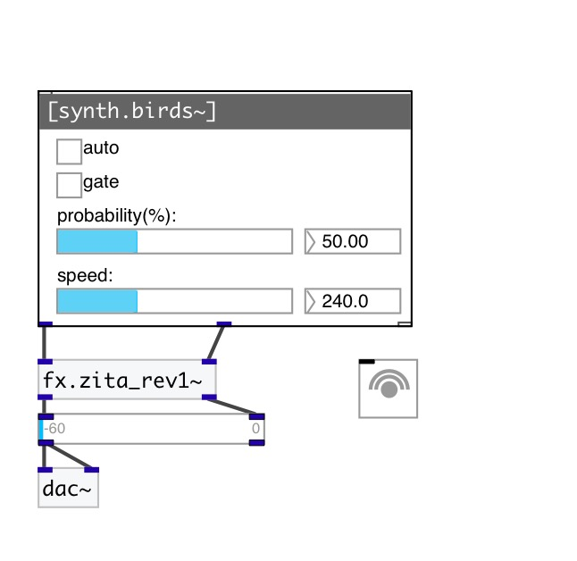

[< reference home](index.html)
---

# synth.birds~

bird singing generator

---

 

---

---
arguments:

---
properties:

@speed: 
            maximum speed of whistles 
@probability: 
            whistles probability 
@active: on/off dsp
            processing 

