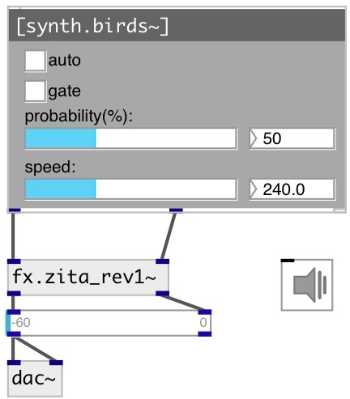

[index](index.html) :: [synth](category_synth.html)
---

# synth.birds~

###### bird singing generator

*available since version:* 0.6

---

## arguments:

* **SPEED**
maximum speed of whistles if @auto enabled 
_type:_ float 

* **PROBABILITY**
whistles probability if @auto enabled 
_type:_ float 
_units:_ % 

## properties:

* **@speed** 
Get/set maximum speed of whistles if @auto enabled 
_type:_ float 
_range:_ 120..480 
_default:_ 240 

* **@probability** 
Get/set whistles probability if @auto enabled 
_type:_ float 
_units:_ % 
_range:_ 25..100 
_default:_ 50 

* **@gate** 
Get/set play trigger. Starts playing on release 
_type:_ bool 
_default:_ 0 

* **@auto** 
Get/set auto playing mode 
_type:_ bool 
_default:_ 0 

* **@active** 
Get/set on/off dsp processing 
_type:_ bool 
_default:_ 1 

* **@osc** (initonly)
Get/set OSC server name to listen 
_type:_ symbol 

* **@id** (initonly)
Get/set OSC address id. If specified, bind all properties to /ID/synth_birds/PROP_NAME
osc address, if empty bind to /synth_birds/PROP_NAME. 
_type:_ symbol 

## inlets:

* play 
_type:_ control

## outlets:

* synth left channel 
_type:_ audio
* synth right channel 
_type:_ audio

## keywords:

[birds](keywords/birds.html)

**Authors:** Pierre Cochard, Serge Poltavsky

**License:** GPL3 or later

