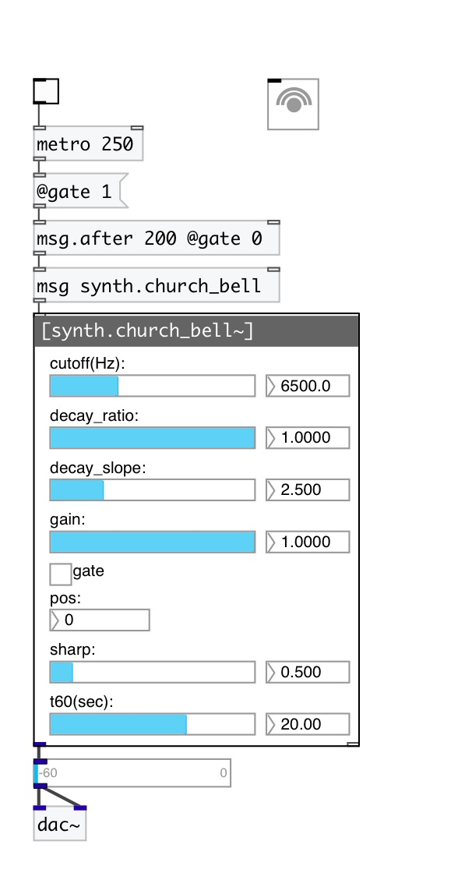

[< reference home](index.html)
---

# synth.church_bell~

generic church bell modal model

---

Modeled after T. Rossing and R. Perrin, Vibrations of Bells, Applied Acoustics 2,
            1987
Model height is 301 mm
This model contains 7 excitation positions going linearly from the bottom to the
            top of the bell
 

---

---
arguments:

---
properties:

@pos: strike position
            (0 is on the bottom) 
@gain: pluck
            gain 
@sharp: strike
            sharpness 
@cutoff: 
            cutoff coefficent 
@gate: play trigger
            - 1: on, 0: off 
@active: on/off dsp
            processing 

