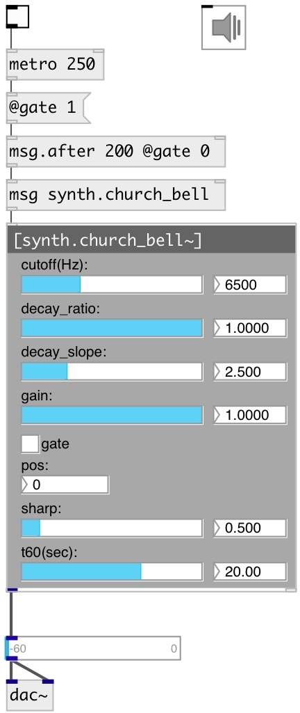

[index](index.html) :: [synth](category_synth.html)
---

# synth.church_bell~

###### generic church bell modal model

*available since version:* 0.6

---

## information
Modeled after T. Rossing and R. Perrin, Vibrations of Bells, Applied Acoustics 2,
            1987
Model height is 301 mm
This model contains 7 excitation positions going linearly from the bottom to the
            top of the bell

## methods:

* **reset**
reset synth 

## properties:

* **@pos** 
Get/set strike position (0 is on the bottom) 
__type:__ int 
__range:__ 0..6 
__default:__ 0 

* **@gain** 
Get/set pluck gain 
__type:__ float 
__range:__ 0..1 
__default:__ 1 

* **@sharp** 
Get/set strike sharpness 
__type:__ float 
__range:__ 0.01..5 
__default:__ 0.5 

* **@cutoff** 
Get/set cutoff coefficent 
__type:__ float 
__units:__ Hz 
__range:__ 20..20000 
__default:__ 6500 

* **@t60** 
Get/set time to decay to -60db level 
__type:__ float 
__units:__ sec 
__range:__ 0.1..30 
__default:__ 20 

* **@decay_ratio** 
Get/set decay ratio 
__type:__ float 
__range:__ 0..1 
__default:__ 1 

* **@decay_slope** 
Get/set decay slope 
__type:__ float 
__range:__ 0..10 
__default:__ 2.5 

* **@gate** 
Get/set play trigger - 1: on, 0: off 
__type:__ float 
__range:__ 0..1 
__default:__ 0 

* **@active** 
Get/set on/off dsp processing 
__type:__ int 
__enum:__ 0, 1 
__default:__ 1 

## inlets:

* play 
__type:__ control 

## outlets:

* synth output
__type:__ audio 

## keywords:

[bell](keywords/bell.html)
[church](keywords/church.html)

**Authors:** Serge Poltavsky

**License:** GPL3 or later

