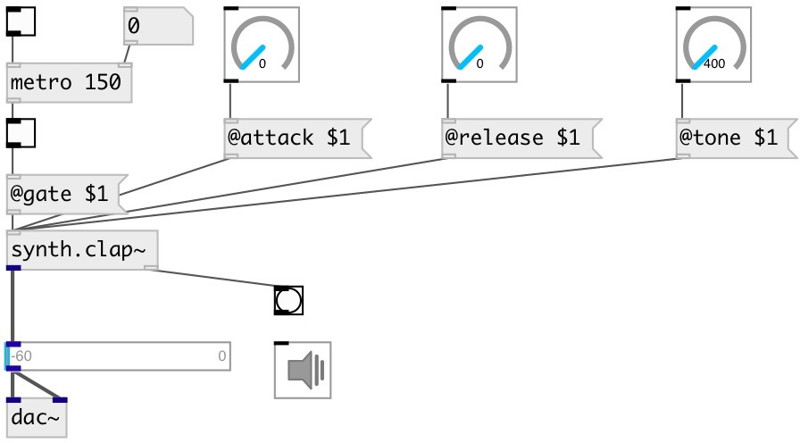

[index](index.html) :: [synth](category_synth.html)
---

# synth.clap~

###### clap synth from faust libraries

*available since version:* 0.9.5

---

## methods:

* **reset**
reset synth 

## properties:

* **@gate** 
Get/set play trigger &gt;0: on, 0: off. To set output gain to 0.5 you can 0.5 as trigger
value 
_type:_ float 
_range:_ 0..1 
_default:_ 0 

* **@active** 
Get/set on/off dsp processing 
_type:_ bool 
_default:_ 1 

* **@attack** 
Get/set attack time 
_type:_ float 
_units:_ ms 
_range:_ 0..400 
_default:_ 0 

* **@release** 
Get/set release time 
_type:_ float 
_units:_ ms 
_range:_ 0..4000 
_default:_ 0 

* **@envwait** 
Get/set ignore new notes until previous note is not finished release time 
_type:_ bool 
_default:_ 0 

* **@tone** 
Get/set bandpass filter cutoff frequency 
_type:_ float 
_units:_ Hz 
_range:_ 400..3500 
_default:_ 3500 

## inlets:

* play with default duration and full gain 
_type:_ control

## outlets:

* synth output 
_type:_ audio
* bang after release finished 
_type:_ control

## keywords:

[synth](keywords/synth.html)
[kick](keywords/kick.html)

**See also:**
[\[synth.kick2~\]](synth.kick2~.html)
[\[synth.hat~\]](synth.hat~.html)

**Authors:** Serge Poltavsky

**License:** GPL3 or later

