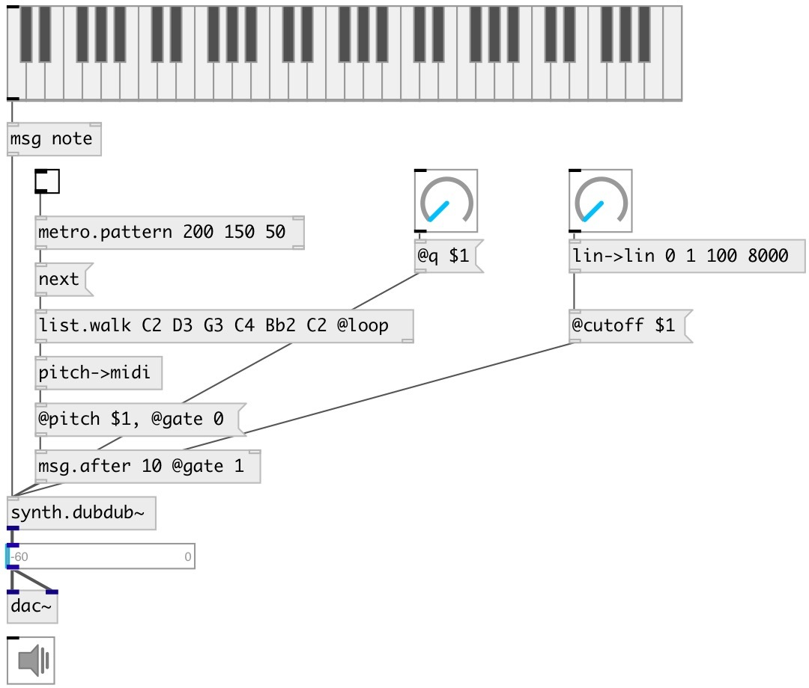

[index](index.html) :: [synth](category_synth.html)
---

# synth.dubdub~

###### simple synth based on a sawtooth wave filtered by a resonant lowpass

*available since version:* 0.6

---

## methods:

* **note**
note on/off message 
  __parameters:__
  - **NOTE** midi note 
    type: float  
    required: True  

  - **VEL** velocity 
    type: float  
    required: True  

## properties:

* **@pitch** 
Get/set midi pitch 
_type:_ float 
_range:_ 24..84 
_default:_ 48 

* **@freq** 
Get/set frequency 
_type:_ float 
_units:_ Hz 
_default:_ 130.813 

* **@cutoff** 
Get/set cutoff frequency 
_type:_ float 
_range:_ 20..20000 
_default:_ 3000 

* **@gate** 
Get/set play trigger &gt;0: on, 0: off. Values greater then zero set output amplitude. 
_type:_ float 
_range:_ 0..1 
_default:_ 0 

* **@q** 
Get/set quality factor 
_type:_ float 
_range:_ 0.01..100 
_default:_ 0.1 

* **@active** 
Get/set on/off dsp processing 
_type:_ int 
_enum:_ 0, 1 
_default:_ 1 

## inlets:

* NOTE VEL 
_type:_ control

## outlets:

* None 
_type:_ audio

## keywords:

[dubdub](keywords/dubdub.html)
[saw](keywords/saw.html)

**Authors:** Serge Poltavsky

**License:** GPL3 or later

