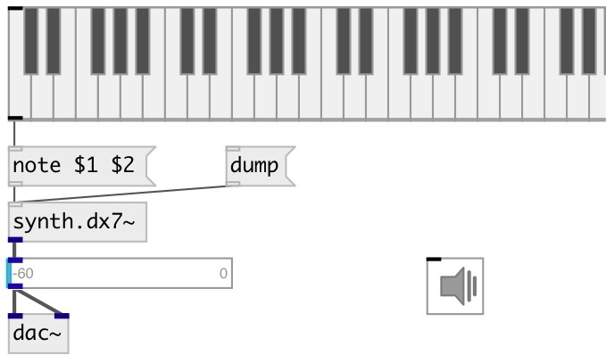

[index](index.html) :: [synth](category_synth.html)
---

# synth.dx7~

###### FAUST dx7 implementation

*available since version:* 0.6

---

## methods:

* **note**
note on/off message 
  __parameters:__
  - **NOTE** midi note 
    type: float  
    required: True  

  - **VEL** velocity 
    type: float  
    required: True  

## properties:

* **@freq** 
Get/set maximum speed of whistles 
_type:_ float 
_units:_ Hz 
_range:_ 0..480 
_default:_ 130.8128 

* **@pitch** 
Get/set midi pitch 
_type:_ float 
_range:_ 24..84 
_default:_ 48 

* **@gate** 
Get/set synth gate (&gt;0 - play) 
_type:_ float 
_range:_ 0..1 
_default:_ 0 

* **@osc** (initonly)
Get/set OSC server name to listen 
_type:_ symbol 

* **@id** (initonly)
Get/set OSC address id. If specified, bind all properties to /ID/synth_dx7/PROP_NAME
osc address, if empty bind to /synth_dx7/PROP_NAME. 
_type:_ symbol 

## inlets:

* NOTE VEL 
_type:_ control

## outlets:

* synth output 
_type:_ audio

## keywords:

[dx7](keywords/dx7.html)
[synth](keywords/synth.html)
[fm](keywords/fm.html)

**Authors:** Serge Poltavsky

**License:** GPL3 or later

