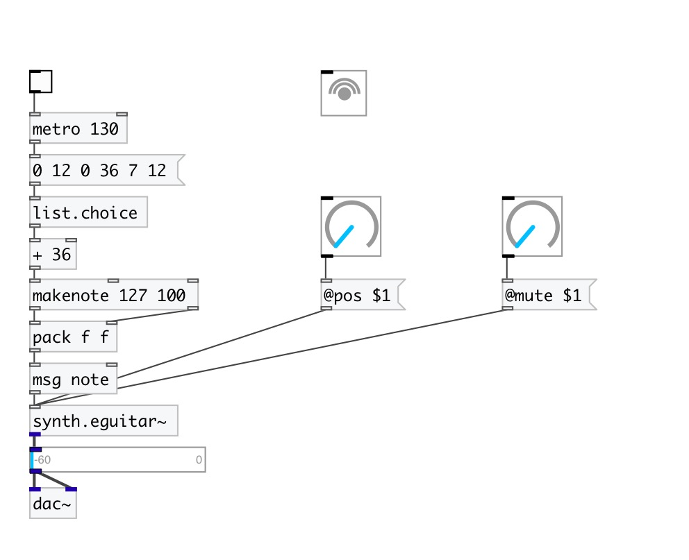

[< reference home](index.html)
---

# synth.eguitar~

simple electric guitar model with steel strings

---

 

---

---
arguments:

---
properties:

@pitch: 
            pitch 
@pos: pluck
            position (1 is on the bridge) 
@mute: mute
            coefficient (0 for no mute and 1 for instant mute) 
@gain: pluck
            gain 
@gate: play trigger
            - 1: on, 0: off 
@active: on/off dsp
            processing 

