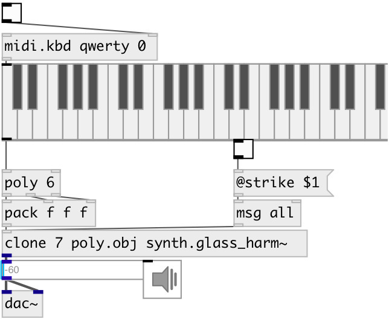

[index](index.html) :: [synth](category_synth.html)
---

# synth.glass_harm~

###### nonlinear banded waveguide modeled Glass Harmonica

*available since version:* 0.9.2

---

## methods:

* **note**
note on/off message 
  __parameters:__
  - **NOTE** midi note 
    type: float  
    required: True  

  - **VEL** velocity 
    type: float  
    required: True  

* **reset**
reset synth 

## properties:

* **@pitch** 
Get/set midi pitch 
__type:__ float 
__range:__ 24..96 
__default:__ 48 

* **@freq** 
Get/set frequency 
__type:__ float 
__units:__ Hz 
__default:__ 130.813 

* **@room_size** 
Get/set reverb room size 
__type:__ float 
__range:__ 0.005..1 
__default:__ 0.36 

* **@nonlin** 
Get/set nonlinearity factor 
__type:__ float 
__range:__ 0..1 
__default:__ 0 

* **@integration** 
Get/set integration constant 
__type:__ float 
__range:__ 0..1 
__default:__ 0 

* **@gain** 
Get/set base gain 
__type:__ float 
__range:__ 0..1 
__default:__ 1 

* **@strike** 
Get/set strike or bow 
__type:__ int 
__range:__ 0..1 
__default:__ 0 

* **@bow_press** 
Get/set bow pressure on the instrument 
__type:__ float 
__range:__ 0..1 
__default:__ 0.2 

* **@modtype** 
Get/set modulation type. 0=theta is modulated by the incoming signal. 1=theta is
modulated by the averaged incoming signal. 2=theta is modulated by the squared
incoming signal. 3=theta is modulated by a sine wave of frequency @modfreq.
4=theta is modulated by a sine wave of frequency @freq 
__type:__ int 
__range:__ 0..4 
__default:__ 0 

* **@modfreq** 
Get/set frequency of the sine wave for the modulation of theta (works if @modetype=3) 
__type:__ float 
__units:__ Hz 
__range:__ 20..1000 
__default:__ 220 

* **@reverb_gain** 
Get/set reverb gain 
__type:__ float 
__range:__ 0..1 
__default:__ 0.137 

* **@width** 
Get/set spatialization width 
__type:__ float 
__range:__ 0..1 
__default:__ 0.5 

* **@pan** 
Get/set pan angle 
__type:__ float 
__range:__ 0..1 
__default:__ 0.6 

* **@gate** 
Get/set play trigger - 1: on, 0: off 
__type:__ float 
__range:__ 0..1 
__default:__ 0 

* **@active** 
Get/set on/off dsp processing 
__type:__ int 
__enum:__ 0, 1 
__default:__ 1 

## inlets:

* NOTE VEL 
__type:__ control 

## outlets:

* left output
__type:__ audio 
* right output
__type:__ audio 

## keywords:

[model](keywords/model.html)
[synth](keywords/synth.html)
[glass](keywords/glass.html)
[harmonica](keywords/harmonica.html)

**Authors:** Romain Michon, Serge Poltavsky

**License:** GPL3 or later

