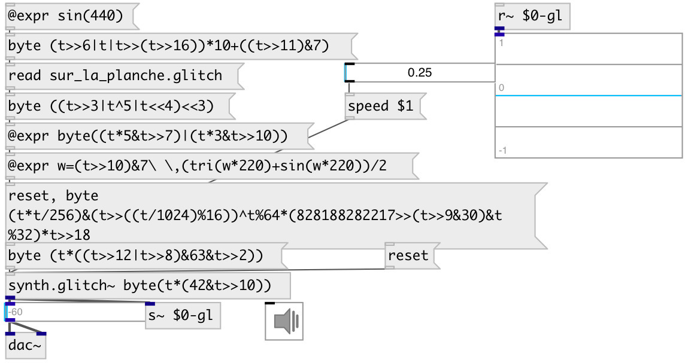

[index](index.html) :: [synth](category_synth.html)
---

# synth.glitch~

###### Glitch synthesizer by naivesound

*available since version:* 0.9.1

---

## information
A minimal, modern and easy-to-use synthesizer for Bytebeat music and not only

## arguments:

* **EXPR**
Glitch expression 
_type:_ list 

## methods:

* **byte**
set expression wrapper to byte() glitch function 

* **read**
read glitch synth file 
  __parameters:__
  - **PATH** path to file 
    type: atom  
    required: True  

* **reset**
reset synth 

* **speed**
set global playing speed for all synth.glitch~ objects 
  __parameters:__
  - **SPEED** speed 
    type: float  
    required: True  

## properties:

* **@expr** 
Get/set expression 
_type:_ list 

* **@clip** 
Get/set clip output to -1..+1 range. Use false value only when you are know what are
you doing and at your own risk! 
_type:_ bool 
_default:_ 1 

## inlets:

* ... 
_type:_ control

## outlets:

* synth output 
_type:_ audio

## keywords:

[glitch](keywords/glitch.html)

**Authors:** naivesound, Serge Poltavsky

**License:** GPL3 or later

