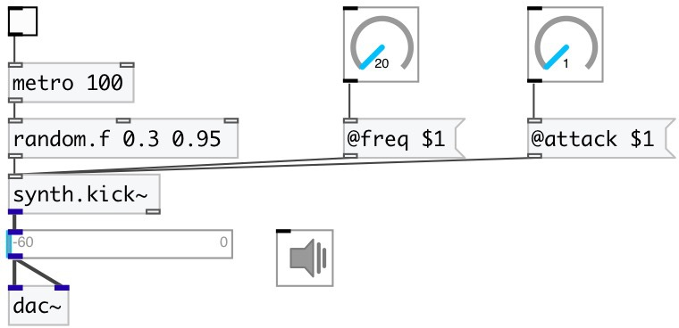

[index](index.html) :: [synth](category_synth.html)
---

# synth.kick~

###### low-kick synth from Guitarix project

*available since version:* 0.9.4

---

## methods:

* **reset**
reset synth 

## properties:

* **@gate** 
Get/set play trigger &gt;0: on, 0: off. To set output gain to 0.5 you can 0.5 as trigger
value 
__type:__ float 
__range:__ 0..1 
__default:__ 0 

* **@active** 
Get/set on/off dsp processing 
__type:__ int 
__enum:__ 0, 1 
__default:__ 1 

* **@attack** 
Get/set attack time 
__type:__ float 
__units:__ ms 
__range:__ 1..50 
__default:__ 10 

* **@release** 
Get/set release time 
__type:__ float 
__units:__ ms 
__range:__ 10..8000 
__default:__ 1000 

* **@envwait** 
Get/set ignore new notes until previous note is not finished release time 
__type:__ int 
__enum:__ 0, 1 
__default:__ 0 

* **@freq** 
Get/set start frequency 
__type:__ float 
__range:__ 10..5000 
__default:__ 50 

## inlets:

* play with default duration and full gain 
__type:__ control 

## outlets:

* synth output
__type:__ audio 
* bang after release finished
__type:__ control 

## keywords:

[synth](keywords/synth.html)
[kick](keywords/kick.html)

**Authors:** Serge Poltavsky

**License:** GPL3 or later

