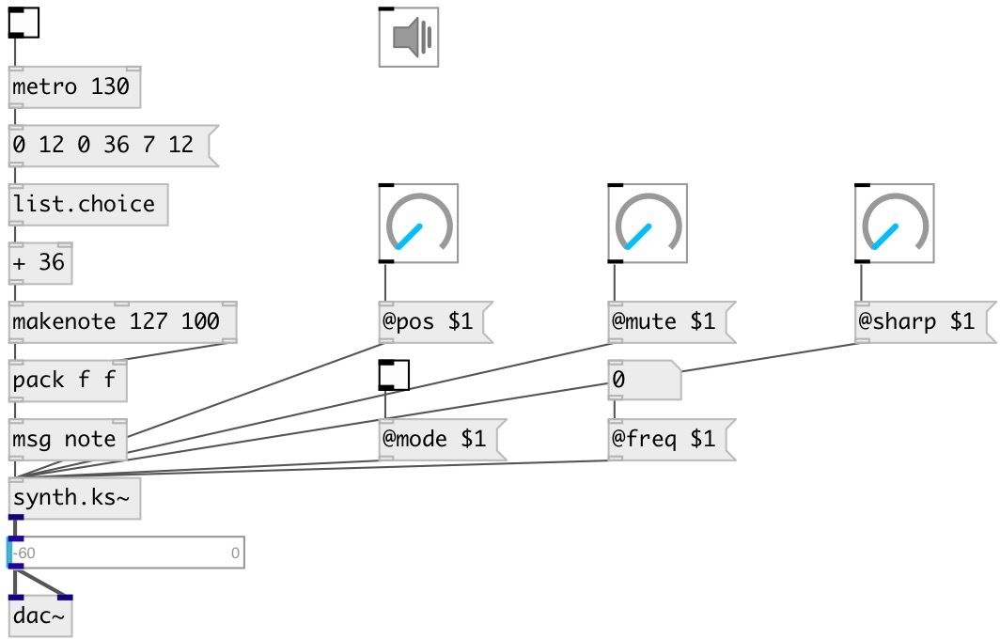

[index](index.html) :: [synth](category_synth.html)
---

# synth.ks~

###### Karplus-Strong string

*available since version:* 0.6

---

## methods:

* **note**
note on/off message 
  __parameters:__
  - **NOTE** midi note 
    type: float  
    required: True  

  - **VEL** velocity 
    type: float  
    required: True  

## properties:

* **@pitch** 
Get/set midi pitch 
__type:__ float 
__range:__ 36..84 
__default:__ 48 

* **@freq** 
Get/set frequency 
__type:__ float 
__units:__ Hz 
__default:__ 130.813 

* **@pos** 
Get/set pluck position (1 is on the bridge) 
__type:__ float 
__range:__ 0..1 
__default:__ 0.7 

* **@mute** 
Get/set mute coefficient (0 for no mute and 1 for instant mute) 
__type:__ float 
__range:__ 0..1 
__default:__ 0 

* **@gain** 
Get/set pluck gain 
__type:__ float 
__range:__ 0..1 
__default:__ 1 

* **@sharp** 
Get/set pluck sharpness 
__type:__ float 
__range:__ 0.01..1 
__default:__ 0.25 

* **@cutoff** 
Get/set cutoff coefficent (for low pass filter) 
__type:__ float 
__range:__ 0.1..1 
__default:__ 1 

* **@mode** 
Get/set excitation mode: 0 - pluck, 1 - strike 
__type:__ int 
__range:__ 0..1 
__default:__ 0 

* **@gate** 
Get/set play trigger - 1: on, 0: off 
__type:__ float 
__range:__ 0..1 
__default:__ 0 

* **@active** 
Get/set on/off dsp processing 
__type:__ int 
__enum:__ 0, 1 
__default:__ 1 

## inlets:

* NOTE VEL 
__type:__ control 

## outlets:

* synth output
__type:__ audio 

## keywords:

[karplus](keywords/karplus.html)
[strong](keywords/strong.html)

**Authors:** Serge Poltavsky

**License:** GPL3 or later

