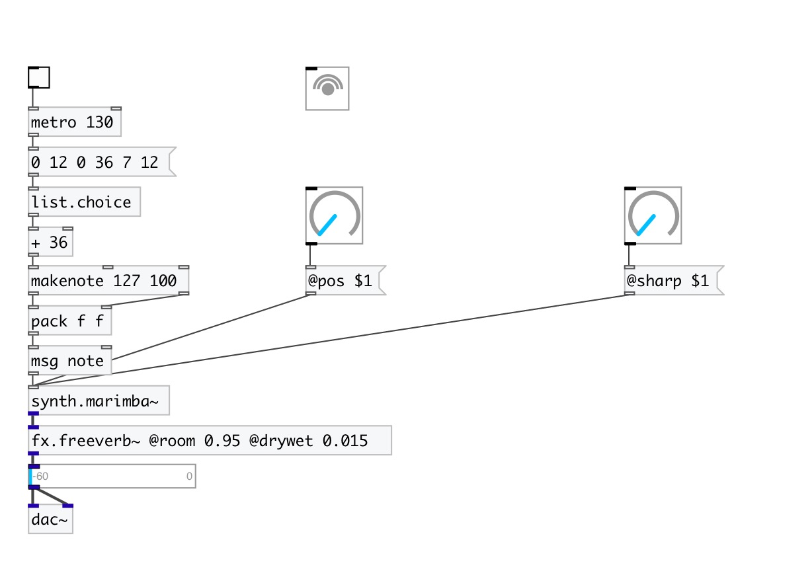

[< reference home](index.html)
---

# synth.marimba~

simple marimba physical model implementing a single tone bar connected to
            tube

---

 

---

---
arguments:

---
properties:

@pitch: 
            pitch 
@pos: excitation
            position 
@cutoff: 
            cuttoff frequency of the strike generator 
@sharp: 
            sharpness of the strike 
@gain: strike
            gain 
@gate: play trigger
            - 1: on, 0: off 
@active: on/off dsp
            processing 

