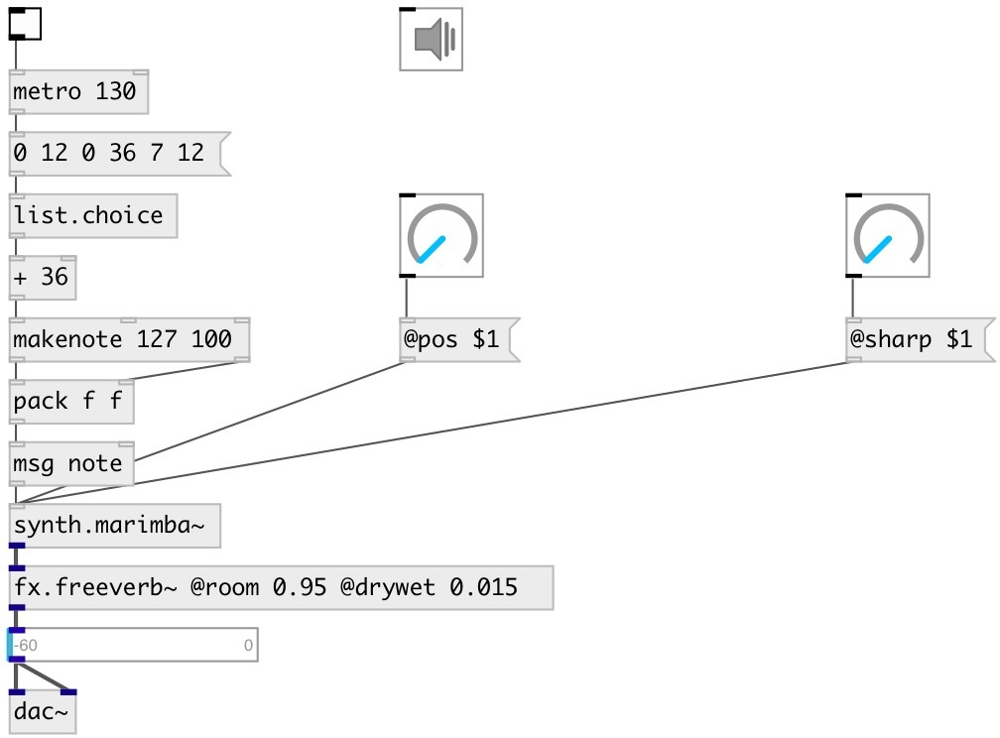

[index](index.html) :: [synth](category_synth.html)
---

# synth.marimba~

###### simple marimba physical model implementing a single tone bar connected to tube

*available since version:* 0.6

---

## methods:

* **note**
note on/off message 
  __parameters:__
  - **NOTE** midi note 
    type: float  
    required: True  

  - **VEL** velocity 
    type: float  
    required: True  

## properties:

* **@pitch** 
Get/set midi pitch 
_type:_ float 
_range:_ 36..84 
_default:_ 48 

* **@freq** 
Get/set frequency 
_type:_ float 
_units:_ Hz 
_default:_ 130.8128 

* **@pos** 
Get/set excitation position 
_type:_ float 
_range:_ 0..4 
_default:_ 0 

* **@cutoff** 
Get/set cuttoff frequency of the strike generator 
_type:_ float 
_range:_ 1000..10000 
_default:_ 7000 

* **@sharp** 
Get/set sharpness of the strike 
_type:_ float 
_range:_ 0.01..1 
_default:_ 0.25 

* **@gain** 
Get/set strike gain 
_type:_ float 
_range:_ 0..1 
_default:_ 1 

* **@gate** 
Get/set play trigger - 1: on, 0: off 
_type:_ float 
_range:_ 0..1 
_default:_ 0 

* **@active** 
Get/set on/off dsp processing 
_type:_ bool 
_default:_ 1 

* **@osc** (initonly)
Get/set OSC server name to listen 
_type:_ symbol 

* **@id** (initonly)
Get/set OSC address id. If specified, bind all properties to
/ID/synth_marimba/PROP_NAME osc address, if empty bind to
/synth_marimba/PROP_NAME. 
_type:_ symbol 

## inlets:

* input signal 
_type:_ control

## outlets:

*   
_type:_ audio

## keywords:

[marimba](keywords/marimba.html)

**Authors:** Serge Poltavsky

**License:** GPL3 or later

