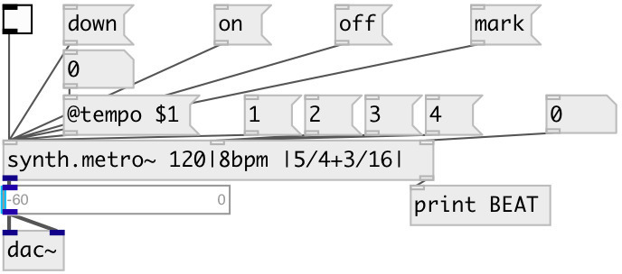

[index](index.html) :: [synth](category_synth.html)
---

# synth.metro~

###### ready to use metronome synth

*available since version:* 0.9.7

---

## arguments:

* **TEMPO**
tempo in beats per minute 
_type:_ symbol 
_units:_ bpm 

* **TSIG**
time signature 
_type:_ symbol 

## methods:

* **down**
manually play downbeat sound 

* **on**
manually play onbeat sound 

* **off**
manually play offbeat sound 

* **mark**
manually play mark sound 

## properties:

* **@tempo** 
Get/set tempo. If beat division is ommitted, using 1/4 
_type:_ symbol 
_units:_ bpm 
_default:_ 60|4bpm 

* **@tsig** 
Get/set metronome time signature, can be complex like: |1/4+15/16| etc. 
_type:_ symbol 
_default:_ |4/4| 

* **@gain** 
Get/set common synth gain 
_type:_ float 
_units:_ db 
_range:_ -12..12 
_default:_ 0 

* **@down.gain** 
Get/set downbeat gain 
_type:_ float 
_units:_ db 
_range:_ -12..12 
_default:_ 6 

* **@on.gain** 
Get/set on-beat gain 
_type:_ float 
_units:_ db 
_range:_ -12..12 
_default:_ 6 

* **@off.gain** 
Get/set off-beat gain 
_type:_ float 
_units:_ db 
_range:_ -12..12 
_default:_ 6 

* **@mark.gain** 
Get/set mark sound gain 
_type:_ float 
_units:_ db 
_range:_ -12..12 
_default:_ 6 

* **@down.freq** 
Get/set downbeat frequency 
_type:_ float 
_units:_ Hz 
_range:_ 100..5000 
_default:_ 1500 

* **@on.freq** 
Get/set on-beat frequency 
_type:_ float 
_units:_ Hz 
_range:_ 100..5000 
_default:_ 1000 

* **@off.freq** 
Get/set off-beat frequency 
_type:_ float 
_units:_ Hz 
_range:_ 100..5000 
_default:_ 500 

* **@mark.freq** 
Get/set mark sound frequency 
_type:_ float 
_units:_ Hz 
_range:_ 100..5000 
_default:_ 2000 

* **@down.reson** 
Get/set downbeat resonance value (Q) 
_type:_ float 
_range:_ 5..100 
_default:_ 50 

* **@on.reson** 
Get/set on-beat resonance value (Q) 
_type:_ float 
_range:_ 5..100 
_default:_ 30 

* **@off.reson** 
Get/set off-beat resonance value (Q) 
_type:_ float 
_range:_ 5..100 
_default:_ 10 

* **@mark.reson** 
Get/set mark sound resonance value (Q) 
_type:_ float 
_range:_ 5..500 
_default:_ 500 

* **@active** 
Get/set on/off dsp processing 
_type:_ bool 
_default:_ 1 

* **@osc** (initonly)
Get/set OSC server name to listen 
_type:_ symbol 

* **@id** (initonly)
Get/set OSC address id. If specified, bind all properties to /ID/synth_metro/PROP_NAME
osc address, if empty bind to /synth_metro/PROP_NAME. 
_type:_ symbol 

## inlets:

* 1: start, 0: stop metronome 
_type:_ control
* 1: play downbeat, 2: play on-beat, 3: play off-beat 
_type:_ control
* set tempo in 1/4 per minute 
_type:_ control

## outlets:

* synth output 
_type:_ audio
* current beat: 1: downbeat, 2: onbeat, 3: offbeat, 4: mark 
_type:_ control

## keywords:

[metro](keywords/metro.html)
[poly](keywords/poly.html)
[rhythm](keywords/rhythm.html)

**Authors:** Serge Poltavsky

**License:** GPL3 or later

