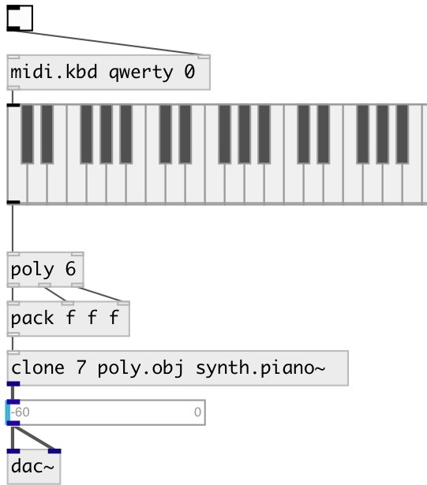

[index](index.html) :: [synth](category_synth.html)
---

# synth.piano~

###### waveguide commuted piano

*available since version:* 0.9.2

---

## methods:

* **note**
note on/off message 
  __parameters:__
  - **NOTE** midi note 
    type: float  
    required: True  

  - **VEL** velocity 
    type: float  
    required: True  

* **reset**
reset synth 

## properties:

* **@pitch** 
Get/set midi pitch 
_type:_ float 
_range:_ 21..108 
_default:_ 48 

* **@freq** 
Get/set frequency 
_type:_ float 
_units:_ Hz 
_default:_ 130.813 

* **@stiffness** 
Get/set stiffness factor 
_type:_ float 
_range:_ 0..1 
_default:_ 0.28 

* **@detuning** 
Get/set detuning factor 
_type:_ float 
_range:_ 0..1 
_default:_ 0.1 

* **@brightness** 
Get/set brightness 
_type:_ float 
_range:_ 0..1 
_default:_ 0 

* **@hammer_hardness** 
Get/set hammer hardness 
_type:_ float 
_range:_ 0..1 
_default:_ 0.1 

* **@room_size** 
Get/set reverb room size 
_type:_ float 
_range:_ 0.005..1 
_default:_ 0.36 

* **@reverb_gain** 
Get/set reverb gain 
_type:_ float 
_range:_ 0..1 
_default:_ 0.137 

* **@width** 
Get/set spatialization width 
_type:_ float 
_range:_ 0..1 
_default:_ 0.5 

* **@pan** 
Get/set pan angle 
_type:_ float 
_range:_ 0..1 
_default:_ 0.6 

* **@gate** 
Get/set play trigger - 1: on, 0: off 
_type:_ float 
_range:_ 0..1 
_default:_ 0 

* **@active** 
Get/set on/off dsp processing 
_type:_ int 
_enum:_ 0, 1 
_default:_ 1 

## inlets:

* NOTE VEL 
_type:_ control

## outlets:

* left output 
_type:_ audio
* right output 
_type:_ audio

## keywords:

[piano](keywords/piano.html)
[model](keywords/model.html)
[synth](keywords/synth.html)

**Authors:** Romain Michon, Serge Poltavsky

**License:** GPL3 or later

