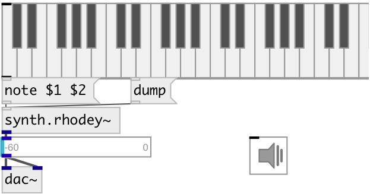

[index](index.html) :: [synth](category_synth.html)
---

# synth.rhodey~

###### STK Fender Rhodes electric piano FM synthesis instrument

*available since version:* 0.6

---

## information
This class implements two simple FM Pairs summed together, also referred to as algorithm 5 of the TX81Z

## methods:

* **cc**
Control change 
  __parameters:__
  - **CTL** control number 
    type: int  
    required: True  

  - **VAL** value 
    type: float  
    required: True  

* **note**
note on/off message 
  __parameters:__
  - **NOTE** midi note 
    type: float  
    required: True  

  - **VEL** velocity 
    type: float  
    required: True  

## properties:

* **@pitch** 
Get/set midi pitch 
_type:_ float 
_range:_ 36..84 
_default:_ 57 

* **@freq** 
Get/set maximum speed of whistles 
_type:_ float 
_units:_ Hz 
_range:_ 0..480 
_default:_ 220 

* **@gate** 
Get/set synth gate (&gt;0 - play) 
_type:_ float 
_range:_ 0..1 
_default:_ 0 

* **@mod** 
Get/set modulator index one (cc2) 
_type:_ int 
_range:_ 0..127 
_default:_ 0 

* **@xfade** 
Get/set crossfade of outputs (cc4) 
_type:_ int 
_range:_ 0..127 
_default:_ 0 

* **@lfo_speed** 
Get/set LFO Speed (cc11) 
_type:_ int 
_range:_ 0..127 
_default:_ 0 

* **@lfo_depth** 
Get/set LFO Speed (cc1) 
_type:_ int 
_range:_ 0..127 
_default:_ 0 

* **@adsr** 
Get/set ADSR 2 &amp; 4 Target 
_type:_ int 
_range:_ 0..127 
_default:_ 0 

## inlets:

* NOTE VEL 
_type:_ control

## outlets:

* synth output 
_type:_ audio

## keywords:

[rhodes](keywords/rhodes.html)
[fender](keywords/fender.html)
[synth](keywords/synth.html)
[fm](keywords/fm.html)

**Authors:** Serge Poltavsky

**License:** GPL3 or later

