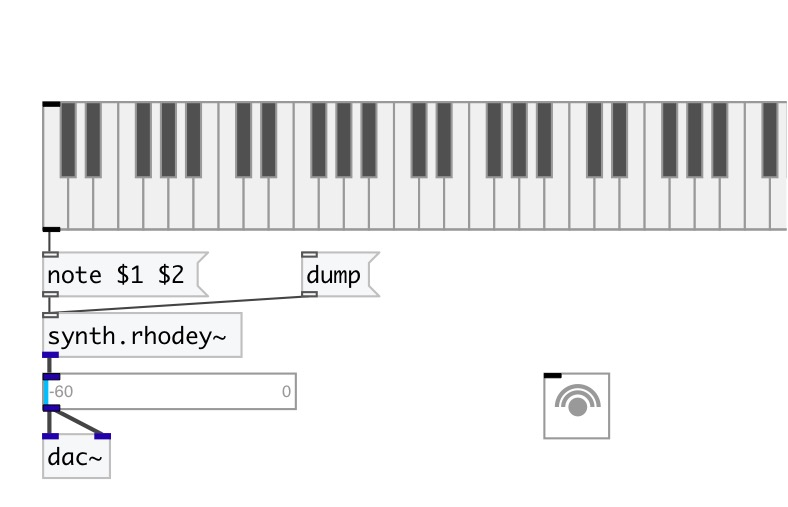

[< reference home](index.html)
---

# synth.rhodey~

STK Fender Rhodes electric piano FM synthesis instrument

---

This class implements two simple FM Pairs summed together, also referred to as
            algorithm 5 of the TX81Z
 

---

---
arguments:

---
properties:

@freq(Hz): maximum speed of whistles 
@gate: synth gate
            (&gt;0 - play) 
@mod: modulator index one
            (cc2) 
@xfade: crossfade of outputs
            (cc4) 
@lfo_speed: LFO Speed
            (cc11) 
@lfo_depth: LFO Speed
            (cc1) 
@adsr: ADSR 2 &amp; 4
            Target 

