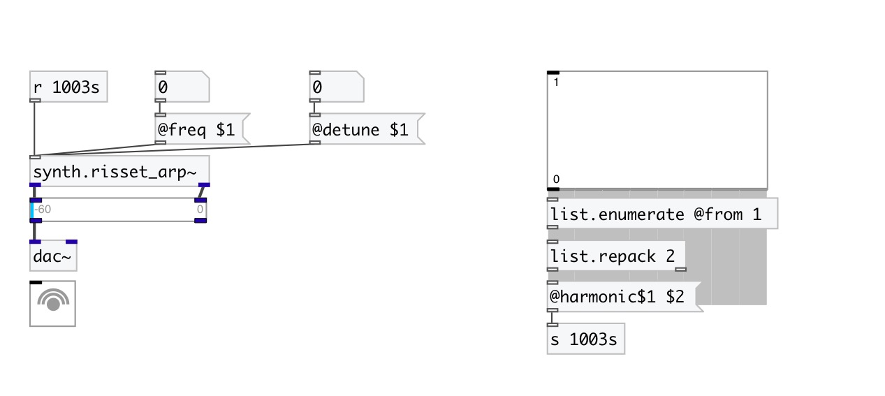

[< reference home](index.html)
---

# synth.risset_arp~

Jean Claude Risset&#39;s harmonic arpeggio effect

---

 

---

---
arguments:

---
properties:

@freq: base
            frequency 
@detune: detune
            percent 
@spread: stereo
            spread 
@harmonic1: 1st
            harmonic amplitude 
@harmonic2: 2nd
            harmonic amplitude 
@harmonic3: 3rd
            harmonic amplitude 
@harmonic4: 4th
            harmonic amplitude 
@harmonic5: 5th
            harmonic amplitude 
@harmonic6: 6th
            harmonic amplitude 
@harmonic7: 7th
            harmonic amplitude 
@harmonic8: 8th
            harmonic amplitude 
@active: on/off dsp
            processing 

