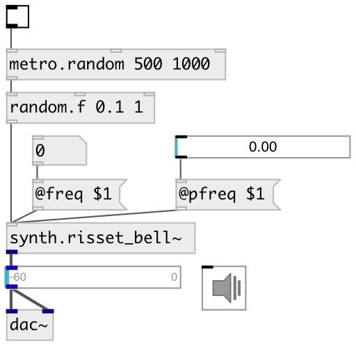

[index](index.html) :: [synth](category_synth.html)
---

# synth.risset_bell~

###### Jean Claude Risset&#39;s bell synth

*available since version:* 0.9.4

---

## arguments:

* **FREQ**
main frequency 
__type:__ float 
__units:__ Hz 

* **DUR**
duration 
__type:__ float 
__units:__ ms 

## methods:

* **reset**
reset synth 

## properties:

* **@freq** 
Get/set base frequency 
__type:__ float 
__units:__ Hz 
__range:__ 1..10000 
__default:__ 440 

* **@pfreq** 
Get/set freq multiplication coefficient 
__type:__ float 
__range:__ 0..10 
__default:__ 1 

* **@dur** 
Get/set duration 
__type:__ float 
__units:__ ms 
__range:__ 10..600000 
__default:__ 5000 

* **@gate** 
Get/set play trigger - 1: on, 0: off 
__type:__ float 
__range:__ 0..1 
__default:__ 0 

* **@active** 
Get/set on/off dsp processing 
__type:__ int 
__enum:__ 0, 1 
__default:__ 1 

## inlets:

* play 
__type:__ control 

## outlets:

* output signal
__type:__ audio 

## keywords:

[risset](keywords/risset.html)
[bell](keywords/bell.html)

**Authors:** Serge Poltavsky

**License:** GPL3 or later

