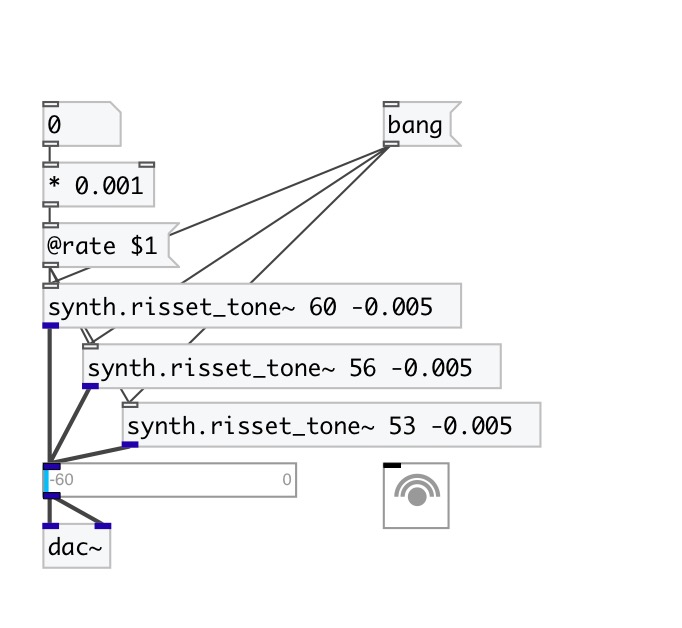

[< reference home](index.html)
---

# synth.risset_tone~

Jean Claude Risset&#39;s endless glissando

---

 

---

---
arguments:

---
properties:

@rate: glissanso
            speed 
@centroid: main
            frequency. Units: MIDI note 
@range: 
            glissando range in MIDI note units 
@active: on/off dsp
            processing 

