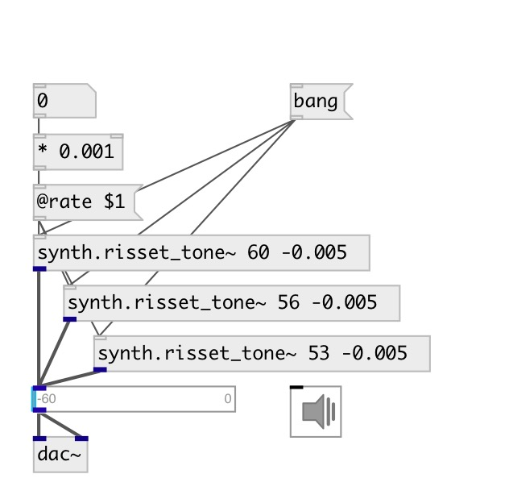

[index](index.html) :: [synth](category_synth.html)
---

# synth.risset_tone~

###### Jean Claude Risset&#39;s endless glissando

*available since version:* 0.5

---

## arguments:

* **CENTROID**
main frequency (MIDI pitch) 
__type:__ float 

* **RATE**
glissanso speed 
__type:__ float 

## methods:

* **reset**
reset to start position 

## properties:

* **@rate** 
Get/set glissanso speed 
__type:__ float 
__range:__ -2..2 
__default:__ 0.01 

* **@centroid** 
Get/set main frequency. Units: MIDI note 
__type:__ float 
__range:__ 20..120 
__default:__ 60 

* **@range** 
Get/set glissando range in MIDI note units 
__type:__ float 
__range:__ 1..120 
__default:__ 120 

* **@active** 
Get/set on/off dsp processing 
__type:__ int 
__enum:__ 0, 1 
__default:__ 1 

## inlets:

* reset to start position 
__type:__ control 

## outlets:

* output signal
__type:__ audio 

## keywords:

[risset](keywords/risset.html)

**Authors:** Oliver Larkin, Serge Poltavsky

**License:** GPL3 or later

