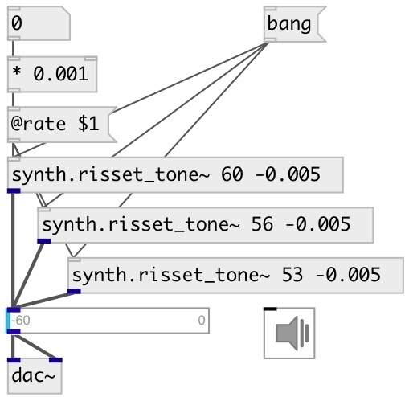

[index](index.html) :: [synth](category_synth.html)
---

# synth.risset_tone~

###### Jean Claude Risset&#39;s endless glissando

*available since version:* 0.5

---

## arguments:

* **CENTROID**
main frequency (MIDI pitch) 
_type:_ float 

* **RATE**
glissanso speed 
_type:_ float 

## methods:

* **reset**
reset to start position 

## properties:

* **@rate** 
Get/set glissanso speed 
_type:_ float 
_range:_ -2..2 
_default:_ 0.01 

* **@centroid** 
Get/set main frequency. Units: MIDI note 
_type:_ float 
_range:_ 20..120 
_default:_ 60 

* **@range** 
Get/set glissando range in MIDI note units 
_type:_ float 
_range:_ 1..120 
_default:_ 120 

* **@active** 
Get/set on/off dsp processing 
_type:_ int 
_enum:_ 0, 1 
_default:_ 1 

## inlets:

* reset to start position 
_type:_ control

## outlets:

* output signal 
_type:_ audio

## keywords:

[risset](keywords/risset.html)

**Authors:** Oliver Larkin, Serge Poltavsky

**License:** GPL3 or later

