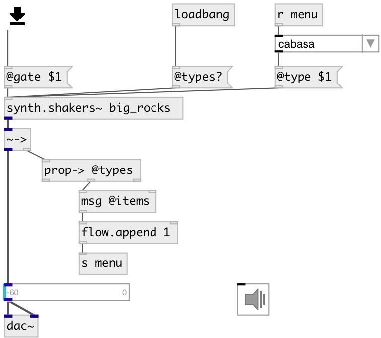

[index](index.html) :: [synth](category_synth.html)
---

# synth.shakers~

###### various percussion sounds from STK library

*available since version:* 0.6

---

## information
PhISEM (Physically Informed Stochastic Event Modeling) is an algorithmic approach
            for simulating collisions of multiple independent sound producing objects. This class
            is a meta-model that can simulate a Maraca, Sekere, Cabasa, Bamboo Wind Chimes, Water
            Drops, Tambourine, Sleighbells, and a Guiro.
PhOLIES (Physically-Oriented Library of Imitated Environmental Sounds) is a
            similar approach for the synthesis of environmental sounds. This class implements
            simulations of breaking sticks, crunchy snow (or not), a wrench, sandpaper, and
            more.

## methods:

* **cc**
Control change 
  __parameters:__
  - **CTL** control number 
    type: int  
    required: True  

  - **VAL** value 
    type: float  
    required: True  

## properties:

* **@gate** 
Get/set synth gate (&gt;0 - play) 
__type:__ float 
__range:__ 0..1 
__default:__ 0 

* **@type** 
Get/set instrument type 
__type:__ atom 
__enum:__ maraca, cabasa, sekere, tambourine, sleigh_bells, bamboo_chimes, sand_paper, coke_can, sticks, crunch, big_rocks, little_rocks, next_mug, penny_mug, nickle_mug, dime_mug, quarter_mug, franc_mug, peso_mug, guiro, wrench, water_drops, tuned_bamboo_chimes 
__default:__ maraca 

* **@types** (readonly)
Get all instrument types 
__type:__ list 
__default:__ maraca cabasa sekere tambourine sleigh_bells bamboo_chimes sand_paper coke_can sticks crunch big_rocks little_rocks next_mug penny_mug nickle_mug dime_mug quarter_mug franc_mug peso_mug guiro wrench water_drops tuned_bamboo_chimes 

## inlets:

* control inlet 
__type:__ control 

## outlets:

* None
__type:__ audio 

## keywords:

[shakers](keywords/shakers.html)
[percussion](keywords/percussion.html)

**Authors:** Serge Poltavsky

**License:** GPL3 or later

