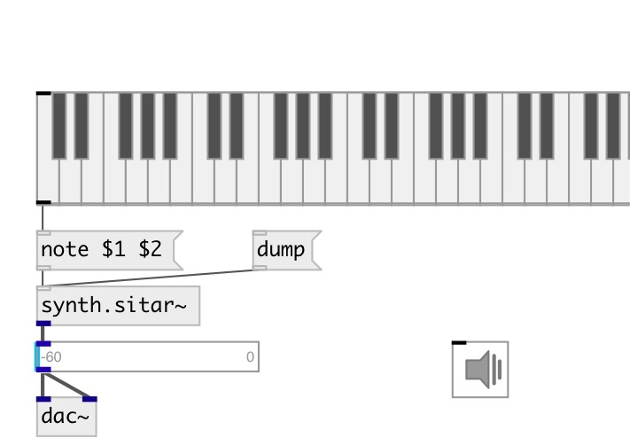

[index](index.html) :: [synth](category_synth.html)
---

# synth.sitar~

###### STK sitar

*available since version:* 0.9.1

---

## information
Implements a sitar plucked string physical model based on the Karplus-Strong algorithm

## methods:

* **cc**
control change message 
  __parameters:__
  - **CTL** control number 
    type: int  
    required: True  

  - **VAL** value 
    type: float  
    required: True  

* **note**
note on/off message 
  __parameters:__
  - **NOTE** midi note 
    type: float  
    required: True  

  - **VEL** velocity 
    type: float  
    required: True  

## properties:

* **@pitch** 
Get/set midi pitch 
_type:_ float 
_range:_ 36..84 
_default:_ 57 

* **@freq** 
Get/set maximum speed of whistles 
_type:_ float 
_units:_ Hz 
_range:_ 0..480 
_default:_ 220 

* **@gate** 
Get/set synth gate (&gt;0 - play) 
_type:_ float 
_range:_ 0..1 
_default:_ 0 

## inlets:

* NOTE VEL 
_type:_ control

## outlets:

* synth output 
_type:_ audio

## keywords:

[sitar](keywords/sitar.html)
[string](keywords/string.html)
[pluck](keywords/pluck.html)
[karplus](keywords/karplus.html)

**Authors:** Serge Poltavsky

**License:** GPL3 or later

