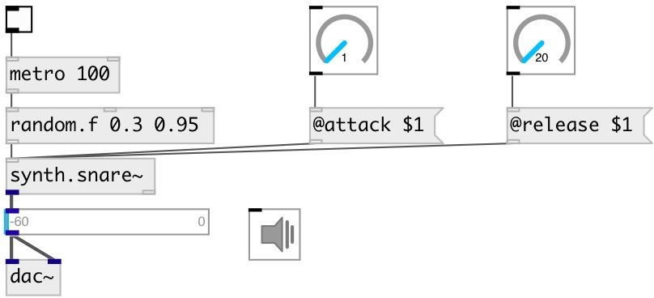

[index](index.html) :: [synth](category_synth.html)
---

# synth.snare~

###### Snare drum synth from Guitarix project

*available since version:* 0.9.4

---

## methods:

* **reset**
reset synth 

## properties:

* **@gate** 
Get/set play trigger &gt;0: on, 0: off. To set output gain to 0.5 you can 0.5 as trigger
value 
__type:__ float 
__range:__ 0..1 
__default:__ 0 

* **@active** 
Get/set on/off dsp processing 
__type:__ int 
__enum:__ 0, 1 
__default:__ 1 

* **@attack** 
Get/set attack time 
__type:__ float 
__units:__ ms 
__range:__ 0.3..100 
__default:__ 0.5 

* **@decay** 
Get/set decay time 
__type:__ float 
__units:__ ms 
__range:__ 1..100 
__default:__ 1 

* **@release** 
Get/set release time 
__type:__ float 
__units:__ ms 
__range:__ 10..1000 
__default:__ 200 

* **@envwait** 
Get/set ignore new notes until previous note is not finished release time 
__type:__ int 
__enum:__ 0, 1 
__default:__ 0 

## inlets:

* play with default duration and full gain 
__type:__ control 

## outlets:

* synth output
__type:__ audio 
* bang after release finished
__type:__ control 

## keywords:

[synth](keywords/synth.html)
[snare](keywords/snare.html)
[drum](keywords/drum.html)

**Authors:** Serge Poltavsky

**License:** GPL3 or later

