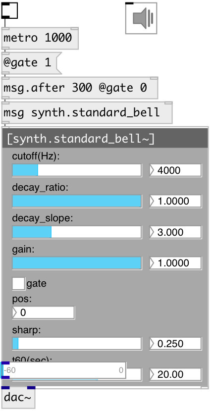

[index](index.html) :: [synth](category_synth.html)
---

# synth.standard_bell~

###### german church bell modal model

*available since version:* 0.9.4

---

## information
Modeled after D. Bartocha and . Baron, Influence of Tin Bronze Melting and Pouring Parameters on Its Properties and Bell&#39; Tone, Archives of Foundry Engineering, 2016 Model height is 1.8m This model contains 7 excitation positions going linearly from the bottom to the top of the bell

## methods:

* **reset**
reset synth 

## properties:

* **@pos** 
Get/set strike position (0 is on the bottom) 
_type:_ int 
_range:_ 0..6 
_default:_ 0 

* **@gain** 
Get/set strike gain 
_type:_ float 
_range:_ 0..1 
_default:_ 1 

* **@sharp** 
Get/set strike sharpness 
_type:_ float 
_range:_ 0.01..5 
_default:_ 0.25 

* **@cutoff** 
Get/set strike cutoff frequency 
_type:_ float 
_units:_ Hz 
_range:_ 20..20000 
_default:_ 4000 

* **@t60** 
Get/set time to decay to -60db level 
_type:_ float 
_units:_ sec 
_range:_ 0.1..30 
_default:_ 20 

* **@decay_ratio** 
Get/set decay ratio 
_type:_ float 
_range:_ 0..1 
_default:_ 1 

* **@decay_slope** 
Get/set decay slope 
_type:_ float 
_range:_ 0..10 
_default:_ 3 

* **@gate** 
Get/set play trigger - 1: on, 0: off 
_type:_ float 
_range:_ 0..1 
_default:_ 0 

* **@active** 
Get/set on/off dsp processing 
_type:_ bool 
_default:_ 1 

## inlets:

* play 
_type:_ control

## outlets:

* output signal 
_type:_ audio

## keywords:

[bell](keywords/bell.html)
[church](keywords/church.html)
[german](keywords/german.html)

**Authors:** Serge Poltavsky

**License:** GPL3 or later

