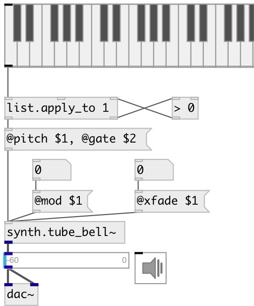

[index](index.html) :: [synth](category_synth.html)
---

# synth.tube_bell~

###### STK tubular bell (orchestral chime) FM synthesis instrument

*available since version:* 0.9.4

---

## information
This class implements two simple FM Pairs summed together, also referred to as algorithm 5 of the TX81Z

## arguments:

* **FREQ**
main frequency 
_type:_ float 
_units:_ Hz 

## methods:

* **note**
note on/off message 
  __parameters:__
  - **NOTE** midi note 
    type: float  
    required: True  

  - **VEL** velocity 
    type: float  
    required: True  

* **cc**
control change message 
  __parameters:__
  - **CTL** control number 
    type: int  
    required: True  

  - **VAL** value 
    type: float  
    required: True  

## properties:

* **@freq** 
Get/set frequency 
_type:_ float 
_units:_ Hz 
_range:_ 0..10000 
_default:_ 220 

* **@pitch** 
Get/set midi pitch 
_type:_ float 
_range:_ 36..84 
_default:_ 57 

* **@gate** 
Get/set play trigger - 1: on, 0: off 
_type:_ float 
_range:_ 0..1 
_default:_ 0 

* **@mod** 
Get/set modulator index one 
_type:_ int 
_range:_ 0..127 
_default:_ 0 

* **@xfade** 
Get/set crossfade of outputs 
_type:_ int 
_range:_ 0..127 
_default:_ 0 

* **@lfo_speed** 
Get/set LFO speed in Hz 
_type:_ int 
_range:_ 0..127 
_default:_ 0 

* **@lfo_depth** 
Get/set LFO delth 
_type:_ int 
_range:_ 0..127 
_default:_ 0 

* **@adsr** 
Get/set ADSR 2 &amp; 4 Target 
_type:_ int 
_range:_ 0..127 
_default:_ 0 

## inlets:

* NOTE VEL 
_type:_ control

## outlets:

* synth output 
_type:_ audio

## keywords:

[tubular](keywords/tubular.html)
[stk](keywords/stk.html)
[bell](keywords/bell.html)

**Authors:** Serge Poltavsky

**License:** GPL3 or later

