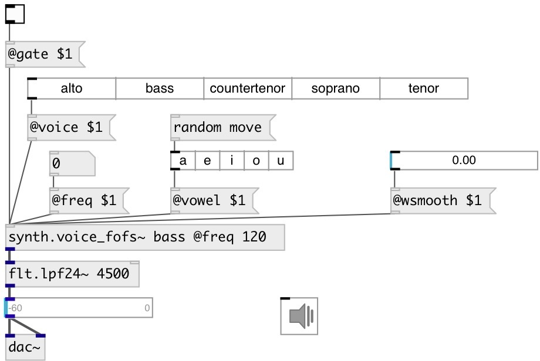

[index](index.html) :: [synth](category_synth.html)
---

# synth.voice_fofs~

###### Simple formant/vocal synthesizer with FOF-smooth filterbank.

*available since version:* 0.9.6

---

## information
Simple formant/vocal synthesizer based on a source/filter model. The source is just a periodic impulse and the &#34;filter&#34; is a bank of FOF filters. Formant parameters are linearly interpolated allowing to go smoothly from one vowel to another. Voice type can be selected but must correspond to the frequency range of the synthesized voice to be realistic.

## arguments:

* **VOICE**
voice type 
_type:_ symbol 

* **VOWEL**
vowel 
_type:_ symbol 

## properties:

* **@freq** 
Get/set frequency 
_type:_ float 
_units:_ Hz 
_range:_ 20..20000.0 
_default:_ 440 

* **@gate** 
Get/set synth gate (&gt;0 - play) 
_type:_ bool 
_default:_ 0 

* **@vibr_freq** 
Get/set vibrato frequency 
_type:_ float 
_units:_ Hz 
_range:_ 1..10 
_default:_ 6 

* **@vibr_gain** 
Get/set vibrato frequency 
_type:_ float 
_range:_ 0..1 
_default:_ 0.5 

* **@voice** 
Get/set voice type. Note: can be set by corresponding index. 
_type:_ symbol 
_enum:_ alto, bass, countertenor, soprano, tenor 
_default:_ alto 

* **@vowel** 
Get/set vowel type. Note: can be set by corresponding index. 
_type:_ symbol 
_enum:_ a, e, i, o, u 
_default:_ a 

* **@attack** 
Get/set attack time 
_type:_ float 
_units:_ ms 
_range:_ 0..1000 
_default:_ 30 

* **@release** 
Get/set release time 
_type:_ float 
_units:_ ms 
_range:_ 0..1000 
_default:_ 50 

* **@active** 
Get/set on/off dsp processing 
_type:_ bool 
_default:_ 1 

* **@portamento** 
Get/set portamento time 
_type:_ float 
_units:_ ms 
_range:_ 0..4000 
_default:_ 0 

* **@wsmooth** 
Get/set vowel smoothing time 
_type:_ float 
_units:_ ms 
_range:_ 0..1000 
_default:_ 10 

* **@fvowel** 
Get/set vowel index: 0=a, 1=e, 2=i, 3=o, 4=u. Float values can be interpoltaed. 
_type:_ float 
_range:_ 0..4 
_default:_ 0 

* **@osc** (initonly)
Get/set OSC server name to listen 
_type:_ symbol 

* **@id** (initonly)
Get/set OSC address id. If specified, bind all properties to
/ID/synth_voice_fofs/PROP_NAME osc address, if empty bind to
/synth_voice_fofs/PROP_NAME. 
_type:_ symbol 

## inlets:

* control input 
_type:_ control

## outlets:

* synth output 
_type:_ audio

## keywords:

[voice](keywords/voice.html)
[fof](keywords/fof.html)
[voice](keywords/voice.html)
[cycle](keywords/cycle.html)

**See also:**
[\[synth.voice_fofc~\]](synth.voice_fofc~.html)

**Authors:** Serge Poltavsky

**License:** GPL3 or later

