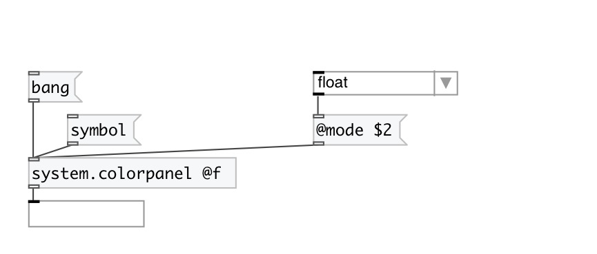

[index](index.html) :: [system](category_system.html)
---

# system.colorpanel

###### System color panel dialog popup

*available since version:* 0.1

---

## properties:

* **@mode** 
Get/set output mode 
_type:_ symbol 
_enum:_ float, int, hex 
_default:_ float 

* **@f** 
Get/set alias for @mode float. Output values as RGB list in 0-1 range. 
_type:_ alias 

* **@i** 
Get/set alias for @mode int. Output values as RGB list in 0-255 range. 
_type:_ alias 

* **@h** 
Get/set alias for @mode hex. Output value as #RRGGBB symbol. 
_type:_ alias 

* **@float** 
Get/set RGB color value in float range (0-1) 
_type:_ list 
_default:_ 1 1 1 

* **@int** 
Get/set RGB color value in int range (0-255) 
_type:_ list 
_default:_ 255 255 255 

* **@hex** 
Get/set color value as #RRGGBB symbol 
_type:_ symbol 
_default:_ #ffffff 

## inlets:

* opens colorpanel 
_type:_ control

## outlets:

* messages: hex color symbol in format #RRGGBB or RGB color triplet in float (0-1) or int (0-255) range depending from @mode 
_type:_ control

## keywords:

[colorpanel](keywords/colorpanel.html)

**Authors:** Hans-Christoph Steiner, Serge Poltavski

**License:** GPL3 or later

