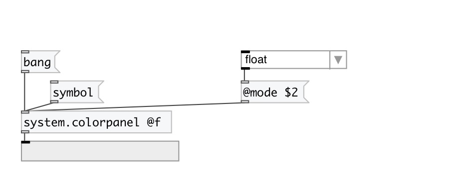

[< reference home](index.html)
---

# system.colorpanel

System color panel dialog popup

---

 

---

---
arguments:

---
properties:

@mode: output
            mode 
@f: alias for @mode float. Output values as RGB list in
            0-1 range. 
@i: alias for @mode int. Output values as RGB list in
            0-255 range. 
@h: alias for @mode hex. Output value as #RRGGBB
            symbol. 
@float: RGB color value in float range
            (0-1) 
@int: RGB color value in int range
            (0-255) 
@hex: color value as #RRGGBB
            symbol 

