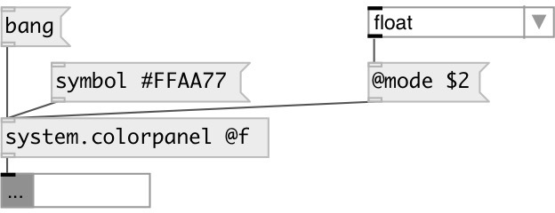

[index](index.html) :: [system](category_system.html)
---

# system.colorpanel

###### System color panel dialog popup

*available since version:* 0.1

---

## properties:

* **@mode** 
Get/set output mode 
__type:__ symbol 
__enum:__ float, int, hex 
__default:__ float 

* **@f** 
Get/set alias for @mode float. Output values as RGB list in 0-1 range. 
__type:__ alias 

* **@i** 
Get/set alias for @mode int. Output values as RGB list in 0-255 range. 
__type:__ alias 

* **@h** 
Get/set alias for @mode hex. Output value as #RRGGBB symbol. 
__type:__ alias 

* **@float** 
Get/set RGB color value in float range (0-1) 
__type:__ list 
__default:__ 1 1 1 

* **@int** 
Get/set RGB color value in int range (0-255) 
__type:__ list 
__default:__ 255 255 255 

* **@hex** 
Get/set color value as #RRGGBB symbol 
__type:__ symbol 
__default:__ #ffffff 

## inlets:

* opens colorpanel 
__type:__ control 

## outlets:

* messages: hex color symbol in format #RRGGBB or RGB color triplet in float
            (0-1) or int (0-255) range depending from @mode
__type:__ control 

## keywords:

[colorpanel](keywords/colorpanel.html)

**Authors:** Hans-Christoph Steiner, Serge Poltavski

**License:** GPL3 or later

