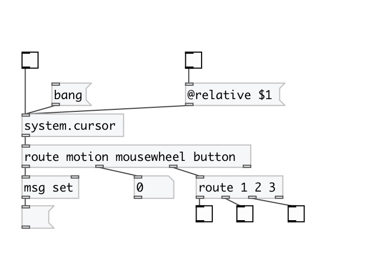

[< reference home](index.html)
---

# system.cursor

Output cursor motion, mousewheel and buttonclicks

---

 

---

---
arguments:

---
properties:

@relative: relative output mode: if
            on output coords relative to window, otherwise output screen coordinates 

