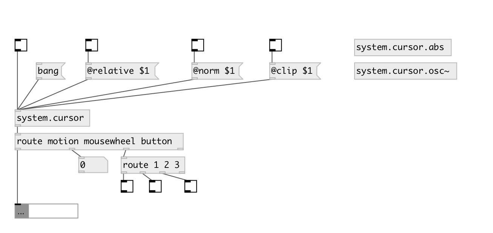

[index](index.html) :: [system](category_system.html)
---

# system.cursor

###### Output cursor motion, mousewheel and button clicks

*available since version:* 0.1

---

## properties:

* **@relative** 
Get/set relative output mode: if on output coords relative to window, otherwise output
screen coordinates 
__type:__ int 
__enum:__ 0, 1 
__default:__ 0 

* **@norm** 
Get/set cursor x/y coordinates normalization by screen (or window) width/height 
__type:__ int 
__enum:__ 0, 1 
__default:__ 0 

## inlets:

* output cursor position 
__type:__ control 

## outlets:

* messages: motion X Y, mousewheel DELTA, button IDX STATE
__type:__ control 

## keywords:

[cursor](keywords/cursor.html)
[mouse](keywords/mouse.html)
[mousewheel](keywords/mousewheel.html)

**Authors:** Hans-Christoph Steiner, Serge Poltavski

**License:** GPL3 or later

