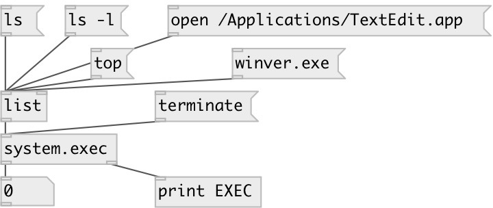

[index](index.html) :: [system](category_system.html)
---

# system.exec

###### run external command in separate process

*available since version:* 0.7

---

## methods:

* **eof**
send EOF to running processes 

* **stop**
stop running process 

* **terminate**
terminate running process 

* **write**
write data to process stdin 

## properties:

* **@is_running** (readonly)
Get is process is running 
_type:_ bool 
_default:_ 0 

* **@low** 
Get/set alias to @priority low 
_type:_ alias 

* **@priority** 
Get/set subprocess priority (not all platforms are supported) 
_type:_ symbol 
_enum:_ normal, low 
_default:_ normal 

* **@state** (readonly)
Get running process state: -1 (no process), 0 (not started), 1 (running), 2
(finished) 
_type:_ int 
_default:_ -1 

## inlets:

* run specified program 
_type:_ control

## outlets:

* output process exit code 
_type:_ control
* output list of strings 
_type:_ control

## keywords:

[system](keywords/system.html)
[execute](keywords/execute.html)

**Authors:** Serge Poltavsky

**License:** GPL3 or later

