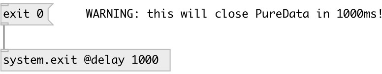

[index](index.html) :: [system](category_system.html)
---

# system.exit

###### quit PureData

*available since version:* 0.9.2

---

## methods:

* **exit**
exit PureData 
  __parameters:__
  - **[RC]** exit code, if not specified @rc property used 
    type: int  

## properties:

* **@delay** 
Get/set exit PureData after specified delay time 
__type:__ float 
__units:__ ms 
__min value:__ 0 
__default:__ 0 

* **@rc** 
Get/set exit code 
__type:__ int 
__default:__ 0 

* **@auto** 
Get/set close automatically, without incoming call 
__type:__ int 
__enum:__ 0, 1 
__default:__ 0 

## inlets:

* control input 
__type:__ control 

## keywords:

[quit](keywords/quit.html)
[exit](keywords/exit.html)

**Authors:** Serge Poltavski

**License:** GPL3 or later

