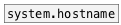

[< reference home](index.html)
---

# system.getenv


Get system environment variables

---

<br>


---


```


[symbol HOME( [symbol APPDATA( [symbol PATH( [symbol USER( [symbol SHELL(
|             |                |             |             |
|             |                |             |             |
|  [B]        |                |             |             |
|  |          |                |             |             |
[system.getenv    USER                                     ]
|
[ui.display]

            
```

---
arguments:

VAR: environment variable name<br>

---
properties:


---
see also:<br>
[](system.hostname.html)
