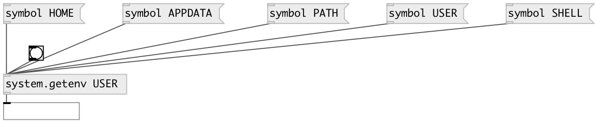

[index](index.html) :: [system](category_system.html)
---

# system.getenv

###### Get system environment variables

*available since version:* 0.1

---

## arguments:

* **VAR**
environment variable name 
__type:__ symbol 

## inlets:

* outputs variable value 
__type:__ control 

## outlets:

* symbol: env-variable value
__type:__ control 

## keywords:

[system](keywords/system.html)
[environment](keywords/environment.html)

**See also:**
[\[system.hostname\]](system.hostname.html)

**Authors:** Alex Nadzharov, Serge Poltavsky

**License:** GPL3 or later

