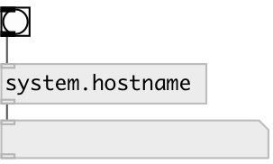

[index](index.html) :: [system](category_system.html)
---

# system.hostname

###### outputs system hostname

*available since version:* 0.1

---

## inlets:

* outputs hostname 
__type:__ control 

## outlets:

* symbol: hostname
__type:__ control 

## keywords:

[system](keywords/system.html)
[hostname](keywords/hostname.html)

**Authors:** Serge Poltavsky

**License:** GPL3 or later

