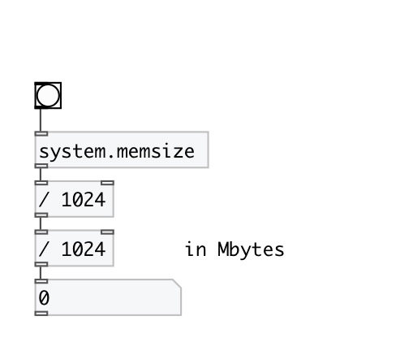

[< reference home](index.html)
---

# system.memsize

returns the size of physical memory (RAM) in bytes round to float data
            type.

---

 

---

---
arguments:

---
properties:

---
see also: 

