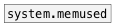

[< reference home](ceammc_lib.html)
---

# system.memsize


returns the size of physical memory (RAM) in bytes round to float data
            type.

---

<br>


---


```


[bng]
|
[system.memsize]
|
[/ 1024]
|
[/ 1024] /* in Mbytes */
|
[floatatom digits=12]

                
            
```

---
arguments:


---
properties:


---
see also:<br>
[](system.memused.html)
