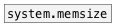

[< reference home](ceammc_lib.html)
---

# system.memused


returns the process physical memory use - current and peak

---

<br>


---


```


[bng]
|
[system.memused]
|
|            /* in Kbytes */
[/ 1024               ]
|                     |
[floatatom digits=12] [floatatom digits=12]

                
            
```

---
arguments:


---
properties:


---
see also:<br>
[](system.memsize.html)
