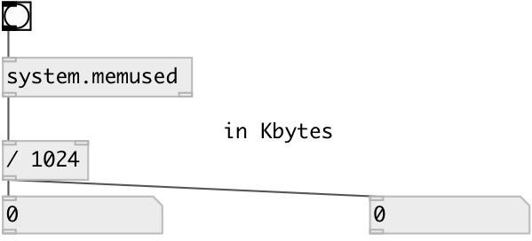

[index](index.html) :: [system](category_system.html)
---

# system.memused

###### outputs the process physical memory usage - current and peak

*available since version:* 0.1

---

## inlets:

* outputs memory use 
_type:_ control

## outlets:

* current physical memory use measured in bytes, or zero if the value cannot be determined on this OS. 
_type:_ control
* peak (maximum so far) physical memory use measured in bytes, or zero if the value cannot be determined on this OS. 
_type:_ control

## keywords:

[system](keywords/system.html)
[memory](keywords/memory.html)

**See also:**
[\[system.memsize\]](system.memsize.html)

**Authors:** Serge Poltavsky

**License:** GPL3 or later

