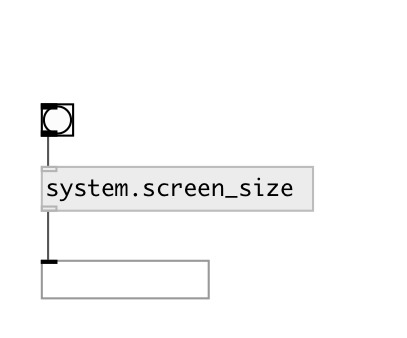

[index](index.html) :: [system](category_system.html)
---

# system.screen_size

###### returns current screen size in pixels

*available since version:* 0.1

---

## inlets:

* outputs screen size in pixels 
_type:_ control

## outlets:

* list of two values: width and height 
_type:_ control

## keywords:

[screen](keywords/screen.html)
[info](keywords/info.html)

**Authors:** Serge Poltavsky

**License:** GPL3 or later

