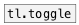

[< reference home](ceammc_lib.html)
---

# tl.bang


Timeline bang (with possible delay)

---

Bang only when nearest left tl.cue was activated. If other cue is activated and
            bang was scheduled by @delay property - it canceled
<br>


---


```


              [tl.cue]           [tl.cue]

[HR number=3]    [tl.bang]                [tl.bang @delay 500]
|                |                        |
[cue $1(         [B]                      [B]
|
[tl.transport]

            
```

---
arguments:


---
properties:

@delay(ms): bang
            delay after cue activation<br>
@cue: related cue<br>

---
see also:<br>
[](tl.toggle.html)
[](tl.cue.html)
