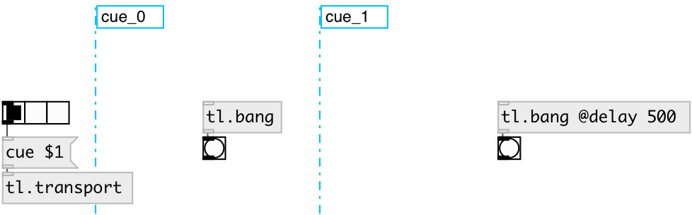

[index](index.html) :: [tl](category_tl.html)
---

# tl.bang
**aliases:** [tl.b]

###### Timeline bang (with possible delay)

*available since version:* 0.1

---

## information
Bang only when nearest left tl.cue was activated. If other cue is activated and bang was scheduled by @delay property - it canceled

## arguments:

* **DELAY**
timeline length 
_type:_ float 
_units:_ ms 

## properties:

* **@delay** 
Get/set bang delay after cue activation 
_type:_ float 
_units:_ ms 
_min value:_ 0 
_default:_ 0 

* **@cue** (readonly)
Get related cue 
_type:_ symbol 

## inlets:

* control inlet 
_type:_ control

## outlets:

* bang output 
_type:_ control

## keywords:

[timeline](keywords/timeline.html)
[bang](keywords/bang.html)

**See also:**
[\[tl.toggle\]](tl.toggle.html)
[\[tl.cue\]](tl.cue.html)

**Authors:** Alex Nadzharov, Serge Poltavsky

**License:** GPL3 or later

