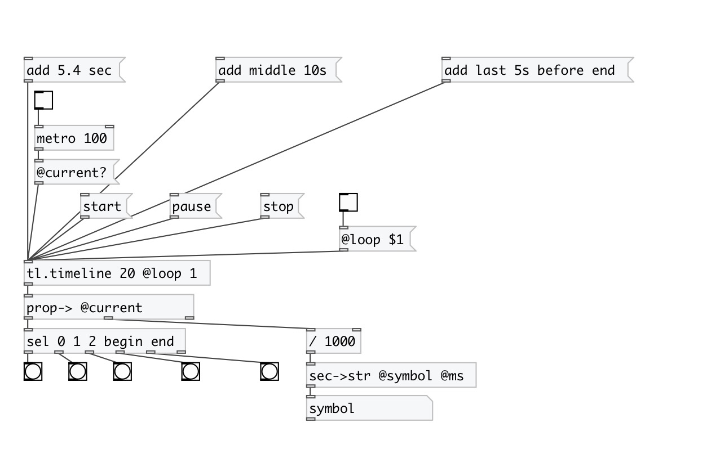

[< reference home](index.html)
---

# tl.timeline

Timeline - event scheduler

---

With timeline you can schedule your events and start/pause/stop/move time
This time formats for event are supported: *clock format* - HH:MM:SS.MS, or values
            like NUMBER UNIT: 10 ms, 10 msec, 20 sec, 30.5s. Note: spaces are ignored.
Empty timeline always contains &#34;end&#34; event, that can&#39;t be removed. Events are
            referred by name or by index. Negative indexes are supported: -1 means last event (not
            &#34;end&#34; event, but last user event)
 

---

---
arguments:

LENGTH(sec): timeline length 

---
properties:

@is_running: if
            timeline is running 
@length(sec): 
            timeline length 
@size(sec): number of
            events in timeline 
@current(ms): 
            current time 
@phase: current phase in [0-1) range 
@events: list of event names
            in chronological order 
@loop: loop mode 
@mode: timeline mode. If
            timeline is fixed, when reached, it outputs *end* event and stops after that. Infinite
            timeline never stops by itself. Fixed timeline can have @loop property for
            repeats 

---
see also: 

